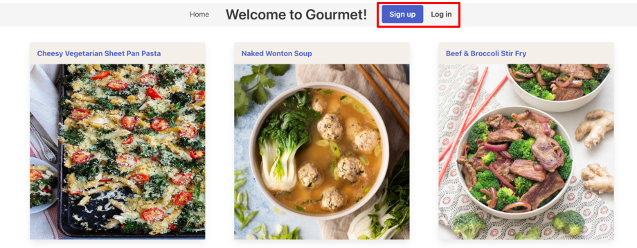
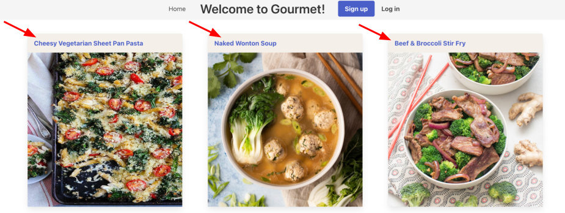
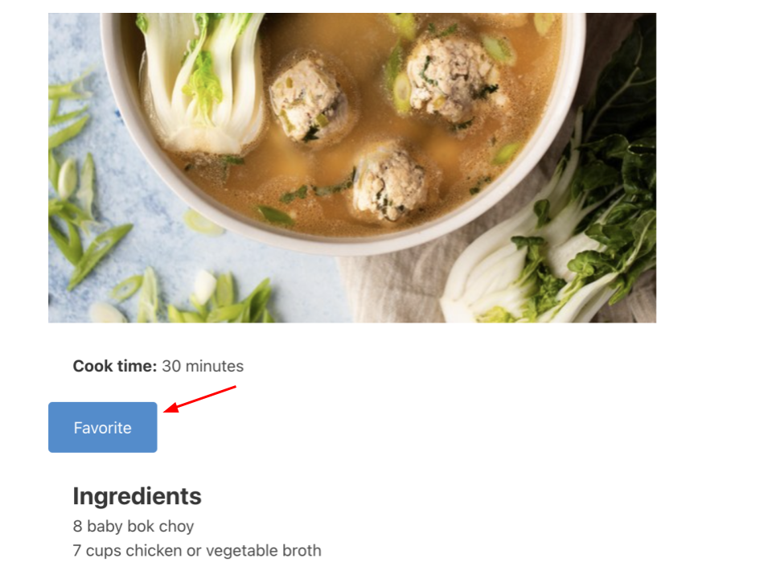
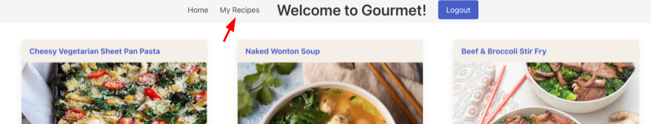
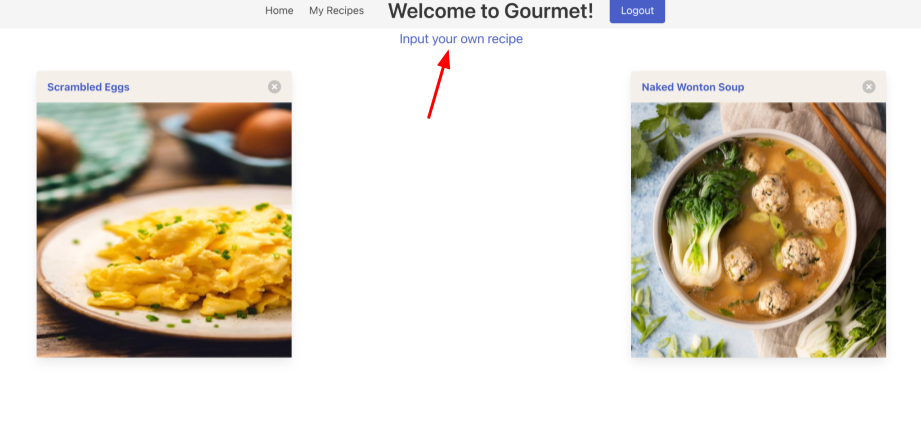
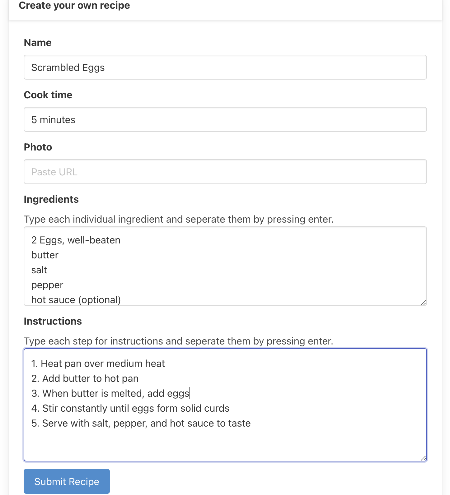

# Gourmet

## About

Gourmet is a recipe sharing website that allows users to create their own personalized cookbook. Save recipes you love, share new ideas with friends, or add something new that you'd like to try! To view deployed code, click <a href="https://salty-oasis-46016.herokuapp.com/">here</a>.

## Motivation 💡

Our desire was to create a convenient way to save and catalog recipes. The ease of having a repository for frequently-used, easy, go-to recipes will help users plan, shop for, and prepare meals at home. Home-cooked meals will be cheaper, healthier, more convenient, and -- hopefully -- tastier than eating out.

We designed the site with the MVC framework in mind, in hopes of learning more about the MVC pattern as well as  asynchronous programming. The site was also instructive in illustrating the challenges and knowledge required to develop a site on both the front and backend.

## Tools 

- HTML
- CSS
- JavaScript
- [Bulma CSS](https://bulma.io/)
- [Node JS](https://nodejs.org/en/download/)
- [Handlebars](https://handlebarsjs.com/installation/)
- MySQL
- [Sequelize](https://sequelize.org/docs/v6/getting-started/)

## Usage

You must create a user account to access the library of recipes, as well as adding and saving your favorites.

Once you have created an account, you can view any of the recipes on the home page

Click on a recipe title to display an ingredient list and cooking instructions.

If you Favorite a Recipe, it will be added your cookbook -- My Recipes -- for easy access

Access My Recipes from the Homepage

You can input your own recipe
Click the [X] on the top right corner of the recipe card to remove a
favorited recipe or delete a recipe you have submitted.

Enter the appropriate data in the text fields.
Your inputted recipes will be included in your My Recipes page.

Note that you must hit enter/return after each line in Ingredients and Instructions.
You must also include an image link or recipe will not be saved.
After the information is entered, click the 'Submit Recipe' button

## Contributors
- [Amy Snarr](https://github.com/sifrult)
- [Brenda Sendejas](https://github.com/brenda255)
- [Miguel Atanacio](https://github.com/Migeru27)
- [Nathan Ward](https://github.com/wardNathan)
- [Nathan Wood](https://github.com/na-br-wo)

## Liscense
MIT License

Copyright (c) 2023 Amy Snarr, Brenda Sendejas, Miguel Atanacio, Nathan Ward, Nathan Wood

Permission is hereby granted, free of charge, to any person obtaining a copy
of this software and associated documentation files (the "Software"), to deal
in the Software without restriction, including without limitation the rights
to use, copy, modify, merge, publish, distribute, sublicense, and/or sell
copies of the Software, and to permit persons to whom the Software is
furnished to do so, subject to the following conditions:

The above copyright notice and this permission notice shall be included in all
copies or substantial portions of the Software.

THE SOFTWARE IS PROVIDED "AS IS", WITHOUT WARRANTY OF ANY KIND, EXPRESS OR
IMPLIED, INCLUDING BUT NOT LIMITED TO THE WARRANTIES OF MERCHANTABILITY,
FITNESS FOR A PARTICULAR PURPOSE AND NONINFRINGEMENT. IN NO EVENT SHALL THE
AUTHORS OR COPYRIGHT HOLDERS BE LIABLE FOR ANY CLAIM, DAMAGES OR OTHER
LIABILITY, WHETHER IN AN ACTION OF CONTRACT, TORT OR OTHERWISE, ARISING FROM,
OUT OF OR IN CONNECTION WITH THE SOFTWARE OR THE USE OR OTHER DEALINGS IN THE
SOFTWARE.
